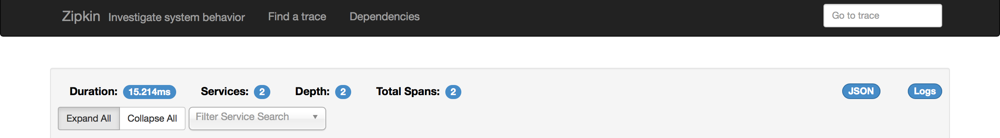

# zipkin-ui

Zipkin-UI是一个单页应用程序，安装在/zipkin。为简单起见，假设下面提到的路径与之相关。例如，UI读取config.json，来自绝对路径/zipkin/config.json

当查看trace时，浏览器被发送到路径"/traces/{id}"。单页应用程序要提供该路由，服务器需要将请求转发到"/index.htm，
同样的转发也适用于"/dependencies"和UI控件的任何其他路由。

在场景下面，JavaScript代码查看窗口。位置来确定UI应该做什么。这是由crossroads library中定义的route api处理的。

为Zipkin-UI的服务请求的建议逻辑如下:
The suggested logic for serving the assets of Zipkin-UI is as follows:

 1. 如果浏览器请求一个含扩展名的文件(即，最后一个路径段有一个`.`)。如果不存在，则返回404
 2. 否则,为`index.html`.

有关使用Finatra的示例实现，请参见 [zipkin-query](https://github.com/openzipkin/zipkin/blob/5dec252e4c562b21bac5ac2f9d0b437d90988f79/zipkin-query/src/main/scala/com/twitter/zipkin/query/ZipkinQueryController.scala).

注意，在请求不存在资源的情况下，此逻辑将返回`index.html`的内容。当以web页面的形式加载时，
客户端应用程序将告知用户找到问题所在。如果没有，就需要采取额外的步骤来找到问题所在——您不会在network选项卡中看到404。

## 为什么它被打包成`.jar` 而不是.zip` ?

由于许多Zipkin服务器都是基于java的，所以将UI作为一个jar分发是很方便的，可以通过Gradle构建工具导入这个 `.jar`文件实际上只是`.zip`文件。
它可以被任何可以解压缩文件的程序打开。

## 我如何通过代理运行 zipkin-backend?

通过指定`proxy`环境变量，您可以将zipkin-ui指向另一个后端，从而允许您在本地开发时访问实际数据。
例如：通过npm运行zipkin-ui `proxy=http://myzipkininstance.com:9411/zipkin/ npm run dev`.
注意，必须以http://前缀和端口后缀

## 如何本地快速开发?

我们的构建中有一个需求目前还没有被满足。您需要安装最新版本的Chrome(>= 59)。
如果构建没有检测到这一点，您可以使用变量[CHROME_BIN](https://github.com/karma-runner/karma-chrome-launcher) 显式地分配一个位置。

maven安装过程下载开发所需的所有其他内容，因此您不需要安装node/npm或其他任何东西。相反，您可以使用`./npm.sh` shell脚本来执行npm操作。
以下是如何启动zipkin server和webapp协同工作:

* 在一个终端中，转到zipkin repo的根目录，运行这个命令来构建zipkin:

```bash
# 在一个终端中，构建zipkin-server及使其依赖项(从zipkin repo的根目录运行)
$ ./mvnw -DskipTests --also-make -pl zipkin-server clean install
# 启动!
$ java -jar ./zipkin-server/target/zipkin-server-*exec.jar
```

* 在另一个终端中，启动zipkin UI server:

```bash
# Do this in another terminal!
$ cd zipkin-ui
$ proxy=http://localhost:9411/zipkin/ ./npm.sh run dev
```

它运行一个NPM开发服务器，当您更改源代码时，它将自动重新构建web应用程序。现在，您应该能够通过http://localhost:9090访问zipkin-ui的本地服务。

## 这是一个为测试创建新span的简单方法?

使用这个设置，如果您打开web UI并从zipkin-server找到一个跟踪，您可以通过右键单击跟踪页面上的JSON按钮(右上角)并执行“Save As”来下载一个JSON blob。
修改span.json，然后通过curl测试

```bash
$ curl -H "Content-Type: application/json" --data @span.json http://localhost:9411/api/v1/spans
```

## 如何查找与特定trace关联的日志 

因为zipkin提供了一个id(trace id)，所以将它添加到日志中是一个很好的模式。如果您使用zipkin，那么很可能您也有分布式日志系统和查询日志的方法(例如ELK堆栈)。

从trace切换到其日志的一个方便方法是获得一个按钮，该按钮将trace直接链接到其日志。

可以通过设置属性`zipkin.ui.logs-url` 激活此功能，或对应的环境变量:

* Kibana 3: `ZIPKIN_UI_LOGS_URL=http://kibana.company.com/query={traceId}`
* Kibana 4 or newer: `ZIPKIN_UI_LOGS_URL=http://kibana.company.com/app/kibana#/discover?_a=(index:'filebeat-*',query:(language:lucene,query:'{traceId}'))`
  这假设日志数据存储在`filebeat-*` 索引模式下(如果需要的话，将其替换为正确的模式)，
  并使用默认的时间范围为15分钟(通过在URL中添加`&_g=(refreshInterval:(display:Off,pause:!f,value:0),time:(from:now-24h,mode:quick,to:now))`来将其更改为24小时)。

其中`{traceId}`将被trace id替换。

如果激活此功能，您将在trace详细信息页面上看到一个名为`logs`的附加按钮。



## 我如何使错误在黄色或红色的时候可见?
UI将“error”标记解释为一个失败的span，并将其涂为红色。它将包含子字符串“error”的annotation解释为临时故障。
为确保UI显示errors，请适当使用[error key](https://zipkin.io/public/thrift/v1/zipkinCore.html#Const_ERROR)。

## 如何调整依赖关系图中的错误率

默认情况下，当错误率为50%或更高时，/dependency端点将链接涂成黄色，当错误率为75%或更高时，则涂成红色。
您可以通过`dependency.low-error-rate`和`dependency.high-error-rate`属性控制这些错误率:

例如，当错误率为10%时，要使行变为黄色，请设置:
`ZIPKIN_UI_DEPENDENCY_LOW_ERROR_RATE=0.1`

若要禁用行着色，请将两个比率都设置为大于1的数字。

## 运行在反向代理之后
从Zipkin `1.31.2`开始，Zipkin UI支持在任意上下文根下运行。因此，它可以在与`/zipkin/`不同的路径下运行，比如`/proxy/foo/bar/zipkin/`。

> 注意，Zipkin要求最后一段路径是`zipkin`.

> 还要注意，由于`html-webpack-plugin`的限制，Zipkin UI依赖于要在index.html文件中设置[`base` tag](https://www.w3schools.com/TAgs/tag_base.asp)及其`href`属性。
默认情况下，它的值是`/zipkin/`，因此反向代理必须将该值重写为另一个alternate _context root。

### Apache HTTP作为Zipkin反向代理
要将Apache HTTP配置为反向代理，需要进行如下配置。
```
LoadModule proxy_module libexec/apache2/mod_proxy.so
LoadModule proxy_html_module libexec/apache2/mod_proxy_html.so
LoadModule proxy_http_module libexec/apache2/mod_proxy_http.so

ProxyPass /proxy/foo/bar/ http://localhost:9411/
SetOutputFilter proxy-html
ProxyHTMLURLMap /zipkin/ /proxy/foo/bar/zipkin/
ProxyHTMLLinks  base        href
```

要访问通过反向代理运行的Zipkin UI，请执行:
```bash
$ curl http://localhost/proxy/foo/bar/zipkin/
<html><head><!--
      add 'base' tag to work around the fact that 'html-webpack-plugin' does not work
      with '__webpack_public_path__' being set as reported at https://github.com/jantimon/html-webpack-plugin/issues/119
    --><base href="/proxy/foo/bar/zipkin/"><link rel="icon" type="image/x-icon" href="favicon.ico"><meta charset="UTF-8"><title>Webpack App</title><link href="app-94a6ee84dc608c5f9e66.min.css" rel="stylesheet"></head><body>
  <script type="text/javascript" src="app-94a6ee84dc608c5f9e66.min.js"></script></body></html>
```
如您所见，`base`标记的属性`href`被重写，这是绕过`html-webpack-plugin`限制的方法。

上传span
```bash
$ curl -H "Content-Type: application/json" --data-binary "[$(cat ../benchmarks/src/main/resources/span-local.json)]" http://localhost/proxy/foo/bar/api/v1/spans
```

然后在UI中可以观察到:
```bash
$ open http://localhost/proxy/foo/bar/zipkin/?serviceName=zipkin-server&startTs=1378193040000&endTs=1505463856013
```
### 如何配置安全性(身份验证、授权)? 

Zipkin UI可以通过在认证代理(如[Apache HTTPD](https://httpd.apache.org/docs/current/howto/auth.html), [Nginx](https://nginx.org/en/docs/http/ngx_http_auth_basic_module.html)或类似的代理)后面运行来保护它。你或许要参考将apache http作为UI的反向代理运行的[说明](#apache-http-as-a-zipkin-reverse-proxy)，因为这可能有点棘手。

注意，默认情况下，Zipkin server同时运行UI  ('/zipkin') 和span collector ('/api')端点。保护UI的配置应该只针对UI端点，而不是客户端获取取span数据。
